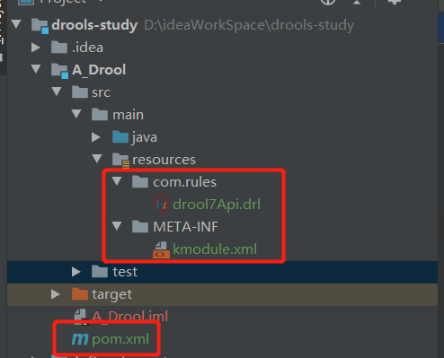
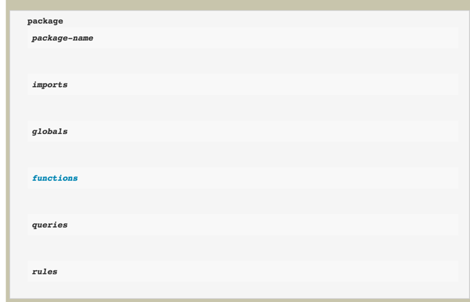
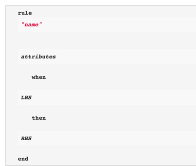
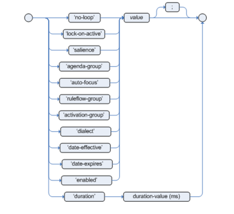
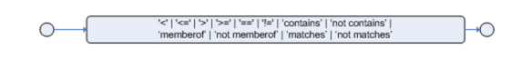
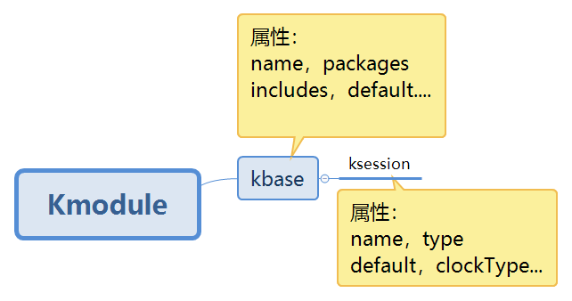

# 参考：

https://www.cnblogs.com/jpfss/p/10870002.html

https://edu.csdn.net/course/detail/5523

# 1 目录结构



| 文件        | 作用                                                     |
| ----------- | -------------------------------------------------------- |
| *.drl       | 是Drools中的规则文件，规则文件的编写，遵循Drools规则语法 |
| kmodule.xml | 这个配置文件告诉代码规则文件drl在哪里                    |
| pom.xml     | maven依赖                                                |

***.drl文件示例：**

```
package com.rules
import com.drools.model.Car
import com.drools.model.Person

rule "test-drools7-older-than-60"
when
    $car : Car(person.age > 60)
then
    $car.setDiscount(80);
    System.out.println("test-drools7-older than 60：" + $car.getPerson().getAge());
end
```

**kmodule.xml文件示例：**

```xml
<?xml version="1.0" encoding="UTF-8"?>
<kmodule xmlns="http://www.drools.org/xsd/kmodule">
    <kbase name="rules" packages="com.rules">
        <ksession name="all-rules"/>
    </kbase>
</kmodule>
```

# 2 drl文件

## 2.1 规则描述语言目录结构



**package：**对一个规则文件而言，package是必须定义的，必须放在规则文件第一行，package的名字是随意的，不必必须对应物理路径，跟java的package的概念不同，这里只是逻辑上的一种区分

``` Java
package com.sankuai.meituan.waimai.drools.demo;
```

**import：**导入规则文件需要使用到的外部规则文件或者变量，这里的使用方法跟java相同，但是不同于java的是，这里的import导入的不仅仅可以是一个类，也可以是这个类中的某一个可访问的静态方法

```java
import com.drools.demo.point.PointDomain;
```

**rule：**定义一个具体规则。rule "ruleName"。一个规则可以包含三个部分：

- **属性部分：** 定义当前规则执行的一些属性等，比如是否可被重复执行、过期时间、生效时间等。

- **条件部分（LHS）：** 定义当前规则的条件，如 when Message(); 判断当前workingMemory中是否存在Message对象。

- **结果部分(RHS)：** 即当前规则条件满足后执行的操作，可以直接调用Fact对象的方法来操作应用。这里可以写普通java代码



```
rule "ruleName"
     no-loop true

     when
         $message:Message(status == 0)

     then
         System.out.println("fit");
         $message.setStatus(1);
         update($message);
end
```


## 2.2 规则描述语言详情

**属性详情**

- **no-loop：** `定义当前的规则是否不允许多次循环执行，默认是false`；当前的规则只要满足条件，可以无限次执行。什么情况下会出现一条规则执行过一次又被多次重复执行呢？drools提供了一些api，可以对当前传入workingMemory中的Fact对象进行修改或者个数的增减，比如上述的update方法，就是将当前的workingMemory中的Message类型的Fact对象进行属性更新，这种操作会触发规则的重新匹配执行，可以理解为Fact对象更新了，所以规则需要重新匹配一遍，那么疑问是之前规则执行过并且修改过的那些Fact对象的属性的数据会不会被重置？结果是不会，已经修改过了就不会被重置，update之后，之前的修改都会生效。当然对Fact对象数据的修改并不是一定需要调用update才可以生效，简单的使用set方法设置就可以完成，这里类似于java的引用调用，所以何时使用update是一个需要仔细考虑的问题，一旦不慎，极有可能会造成规则的死循环。上述的no-loop true，即设置当前的规则，只执行一次，如果本身的RHS部分有update等触发规则重新执行的操作，也不要再次执行当前规则。
  但是其他的规则会被重新执行，岂不是也会有可能造成多次重复执行，数据紊乱甚至死循环？答案是使用其他的标签限制，也是可以控制的：lock-on-active true

- **lock-on-active：**lock-on-active true 通过这个标签，可以控制当前的规则只会被执行一次，因为一个规则的重复执行不一定是本身触发的，也可能是其他规则触发的，所以这个是no-loop的加强版

- **date-expires：**设置规则的过期时间，默认的时间格式：“日-月-年”

- **date-effective**：设置规则的生效时间，时间格式同上。

- **duration**：规则定时，duration 3000，3秒后执行规则

- **salience**：优先级，数值越大越先执行，这个可以控制规则的执行顺序。

  

**条件部分- LHS**

- **when**：规则条件开始。条件可以单个，也可以多个，多个条件一次排列
  如：当前规则只有在这三个条件都匹配的时候才会执行RHS部分

```
when
      eval(true)
      $customer:Customer()
      $message:Message(status==0)
```

- **eval(true)：**是一个默认的api，true 无条件执行，类似于 while(true)

- **操作符**：`>`、`>=`、`<`、`<=`、`==`、`!=`、`contains`、`not contains`、`memberOf`、`not memberOf`、`matches`、`not matches`

  - **contains：** 对比是否包含操作，操作的被包含目标可以是一个复杂对象也可以是一个简单的值
    `Person( fullName contains "Jr" )`
    
  - **not contains：**与contains相反。
  
  - **memberOf：**判断某个Fact属性值是否在某个集合中，与contains不同的是他被比较的对象是一个集合，而contains被比较的对象是单个值或者对象
    `CheeseCounter( cheese memberOf $matureCheeses )`
    
  - **not memberOf**：与memberOf正好相反
  
- **matches**：正则表达式匹配
    `Cheese( type matches "(Buffalo)?\\S*Mozarella" )`
    **注意：** `就像在Java中，写为字符串的正则表达式需要转义“\”`
    
  - **not matches：**与matches正好相反
  
    
  

**结果部分- RHS**

当规则条件满足，则进入规则结果部分执行，结果部分可以是纯java代码

- **then：**

```
then
     System.out.println("OK"); //会在控制台打印出ok
end
```

- **insert：**往当前workingMemory中插入一个新的Fact对象，会触发规则的再次执行，除非使用no-loop限定
- **update：**更新
- **modify：**修改，与update语法不同，结果都是更新操作
- **retract：**删除

```
rule "Rule 03" 
      when 
          $number : Number( ) 
          not Number( intValue < $number.intValue ) 
      then 
          System.out.println("Number found with value: " + $number.intValue() ); 
          retract( $number );
end
```

# 3 kmodule.xml文件



- Kmodule： 中可以包含一个到多个 kbase,分别对应 drl 的规则文件。

- Kbase： 需要一个唯一的 name,可以取任意字符串。

- packages： 为drl文件所在resource目录下的路径。注意区分drl文件中的package与此处的package不一定相同。多个包用逗号分隔。默认情况下会扫描 resources目录下所有(包含子目录)规则文件。

- kbase的default属性：标示当前KieBase是不是默认的,如果是默认的则不用名称 就可以查找到该 KieBase,但每个 module 最多只能有一个默认 -
   KieBase。

- kbase的ksession： kbase下面可以有一个或多个 ksession，ksession 的 name 属性必须设置,且必须唯一。

  

# 4 常用的Api